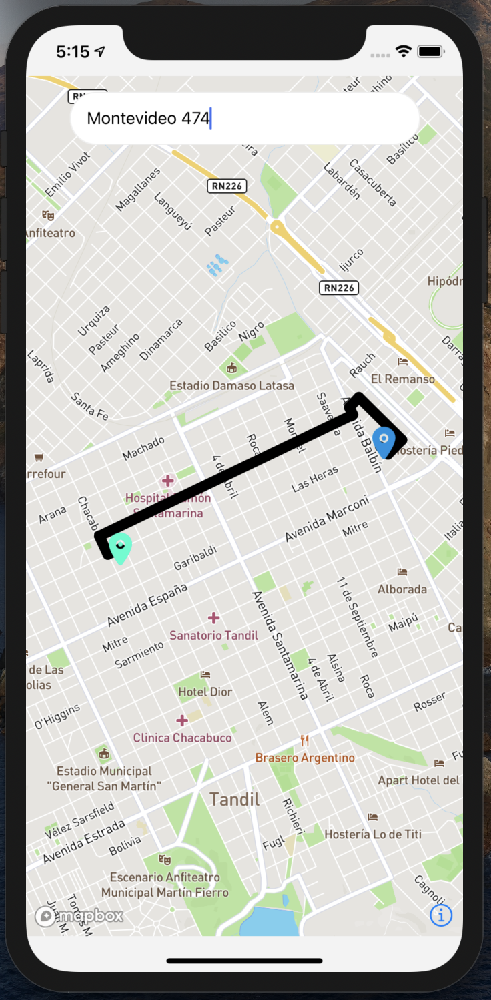

# Dollaride Challenge

## Prerequisit

* node >= 12
* `ANDROID_SDK_ROOT` environment variable defined or create the file `/android/local.properties` and add the sdk.dir path like this: `sdk.dir = /Users/USERNAME/Library/Android/sdk`

## Setup

1. Install the dependencies running `yarn` or `npm i`
2. Go to the *ios* folder and run `pod install`
3. Go back to the main folder and run `npx react-native start` to start **Metro**
4. In a different terminal run `npmx react-native run-ios` or `npmx react-native run-android` to build the app
5. Add your private keys in `/config/Environment.js` in order to use Mapbox & the Google services

### After this steps you should see the app:

## Notes
* I tried to add tests but it seems there is an issue betweem `jest` and `NativeEventEmitter`. Visit this thread for more details: https://github.com/react-native-mapbox-gl/maps/issues/998
